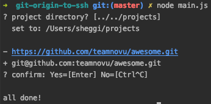

git-origin-to-ssh
=================

Changes all git remote origin urls from https to ssh.
```
https://github.com/teamnovu/awesome.git
to
git@github.com:teamnovu/awesome.git
```

Run script and enter path to your project directory.
```
node main.js
```


